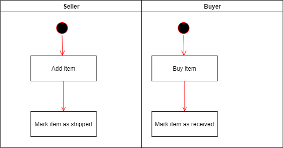
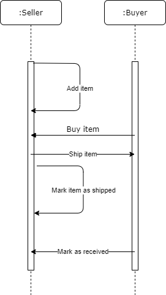
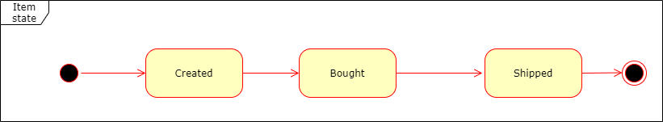
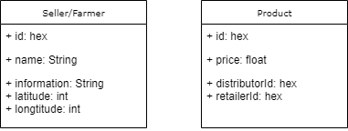

# General Write Up
Todo "like steps and contracts address"

# UML diagrams

Activity:

Sequence:

State:

Classes (Data Model):

# Libraries used

Truffle v4.1.17 (uses web3 0.*)
web3 v0.20.7

# IPFS used

No